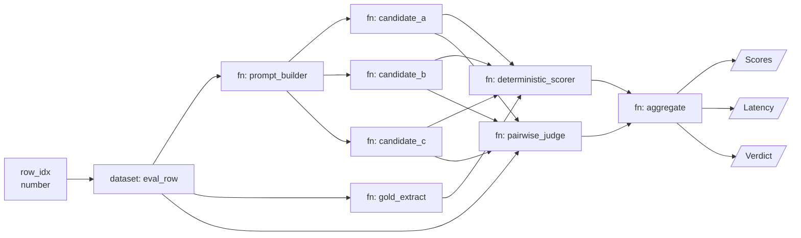

# Design: Hot-Swappable Model Eval Arena on gr.Workflow

**Date:** 2026-09-23
**Status:** Approved, ready for implementation planning
**Source spec:** `Spec Hot-Swappable Model Eval Arena on gr.Workflow.docx`
**Deploys to:** a public Hugging Face Space (Gradio SDK, CPU basic)

## Overview and goals

The arena is one `gr.Workflow` graph that runs a single eval row through three
candidate models, scores each with deterministic checks plus a pairwise LLM
judge, and exposes the result through the generated REST API. Candidates are
configuration, so swapping a model is a one-line edit, not a rebuild. An
external driver turns the per-row graph into full-dataset runs and pushes
results to a Hub dataset.

Every intermediate output — raw generation, parsed answer, judge rationale — is
inspectable on the canvas per row. That makes failure analysis much faster than
reading JSONL dumps, which is the reason to build this on `gr.Workflow`.

### Success criteria

- Three candidates wired and emitting an identical envelope.
- One row end to end in under 90 s warm on the canvas.
- Swapping any candidate needs zero edits to the scorer, judge or aggregate
  nodes.
- A full-dataset run completes via the driver with a resumable checkpoint and a
  results dataset on the Hub.
- Repository and the deployed Space are public and contain no tokens, absolute
  paths, or other local environment details.
- One full run costs under USD 0.10.

## Non-goals and constraints

**Non-goals:** replacing SMOLTRACE
([`kshitijthakkar/smoltrace-leaderboard`](https://hf.co/datasets/kshitijthakkar/smoltrace-leaderboard))
for agentic multi-step evals, training or fine-tuning, and a public
leaderboard UI beyond the canvas plus a results dataset. This arena scores
single-turn rows; SMOLTRACE remains the harness for multi-step agent traces.

**Platform constraints that shape the design:**

- **DAG only.** No loops or conditional edges. Anything iterative lives inside
  an fn node or in the external driver.
- **Dataset operator yields one row.** There is no map-over-dataset primitive,
  so batch runs are driven from outside via the REST API.
- **Typed ports.** Structured data between nodes travels as JSON strings on
  text ports; each fn parses and validates.
- **Beta.** Schema version 2 of `workflow.json` may change; pin the Gradio
  version.

**Constraints added during design:**

- **Public artifact.** The repository and the Space are public. No token, no
  absolute path, no local environment detail may appear in any commit.
- **Reference only published work.** Publicly released projects, checkpoints
  and datasets may be named and linked. Private repositories are referred to
  generically and never named, in the repository, the Space, or commit
  messages.
- **Budget.** Total spend across both examples in this repository is capped at
  USD 5.
- **All candidates are public open-weight models.** Anyone who opens the Space
  can run every candidate, and anyone who forks the repository gets a working
  arena. See [Candidate configuration](#candidate-configuration).

## Platform findings that contradict the spec

Three behaviours documented in the `gr.Workflow` guide conflict with the
original spec. Each is resolved below rather than worked around silently.

### One endpoint per connected component, not per output

The guide states: *"Each disconnected pipeline containing one or more subject
nodes gets one endpoint… If the pipeline has multiple subjects, the endpoint
returns all of them in subject declaration order rather than creating one
endpoint per subject."*

The spec's three endpoints — `/scores`, `/latency`, `/verdict` — collapse into
a single endpoint returning all three subjects. This resolves the spec's open
question, *"whether calling /scores and /verdict for the same row re-runs the
whole graph or shares upstream results."* They were never separate endpoints,
so the question does not arise, and the spec's own contingency — *"the driver
must call only /scores, and aggregate must embed verdict and latency in its
payload"* — becomes the only available shape rather than a fallback.

### Fan-out is parallel on the canvas and sequential through the API

The guide states: *"When the same workflow is invoked through its generated
Gradio API, the server currently executes these branches sequentially."*

So the three candidates genuinely run in parallel when a human hits **Run** on
the canvas, and genuinely run one after another when the driver calls the
endpoint. The spec's "under 90 s warm" is a canvas number. Per-row driver
latency is approximately the sum of the three candidates plus the judge.

Both numbers are measured and reported separately rather than designed around,
because there is no way around it.

### `model` nodes expose no latency or token counts

The `model` operator kind carries `model_id`, `endpoint` and `pipeline_tag`,
and returns a result port. Nothing more. This settles the spec's open question,
*"whether model-kind nodes expose latency or token counts. If not, wrap
Qwen3-8B in an fn node using InferenceClient directly so all three candidates
report identical metrics."*

They do not. So **all three candidates are `fn` nodes wrapping
`InferenceClient`**, which is also what makes the uniform envelope possible.

The `model` and `space` operator kinds are demonstrated in the companion
Ślōkārtha example instead, so the pair of examples covers all four kinds.

## Graph topology

One connected component.



The three candidates and `gold_extract` are at the same dependency depth, as
are the scorer and judge. `aggregate` is the only full join. The first subject
is labelled `Scores`, so the endpoint is `/scores` and it returns all three
subjects.

## Node specifications

Every candidate node emits the same JSON envelope so scorers never special-case
a model:

```json
{"model_id": "...", "output": "...", "latency_ms": 0, "tokens_out": 0, "error": null}
```

| Node | Kind | Inputs | Outputs | Notes |
| --- | --- | --- | --- | --- |
| `row_idx` | reference | — | number | Driver sets it per call |
| `eval_row` | dataset | row index | text (JSON row) | Public eval dataset; columns `id, task_type, prompt, gold, meta` |
| `prompt_builder` | fn | row JSON | text | One shared template per `task_type`; chat-template application happens inside each candidate |
| `candidate_a` | fn | prompt | text (envelope) | Reads slot `a` from `candidates.yaml` |
| `candidate_b` | fn | prompt | text (envelope) | Reads slot `b` |
| `candidate_c` | fn | prompt | text (envelope) | Reads slot `c` |
| `gold_extract` | fn | row JSON | text | Normalized gold answer plus answer type |
| `deterministic_scorer` | fn | 3 envelopes + gold | text (JSON) | Per-model: exact match, numeric tolerance, JSON validity, regex extraction |
| `pairwise_judge` | fn | 3 envelopes + row | text (JSON) | 6 concurrent judge calls; see [Scoring design](#scoring-design) |
| `aggregate` | fn | scorer + judge JSON | 3 outputs | Feeds `Scores`, `Latency`, `Verdict` |

`aggregate` has three output ports, which exceeds what signature inference
generates. The guide covers this: *"For media ports or multiple outputs, define
the function node's ports explicitly in the workflow JSON."* `workflow.json` is
hand-authored, so the ports are declared there.

## Candidate configuration

This is where the spec's "hot-swappable" thesis is actually delivered.

Candidates are **public open-weight models, configuration-driven**. The source
spec named in-house checkpoints; those are replaced by open-weight models so
that the arena is reproducible by anyone who opens the Space or forks the
repository. Nothing in the graph depends on which models these are:

```yaml
judge:
  model_id: openai/gpt-oss-20b        # out-of-family from all three candidates
  max_rationale_words: 60
candidates:
  - {slot: a, model_id: Qwen/Qwen3-8B,                      max_new_tokens: 512, greedy: true}
  - {slot: b, model_id: meta-llama/Llama-3.1-8B-Instruct,   max_new_tokens: 512, greedy: true}
  - {slot: c, model_id: ibm-granite/granite-4.2-8b,         max_new_tokens: 512, greedy: true}
```

All four ids were confirmed served by Inference Providers on 2026-09-23. The
three candidates are deliberately the **same size (8B) from three different
families** — Qwen, Llama and Granite — so the comparison is a fair fight rather
than a size contest, and `Qwen/Qwen3-8B` is the one the spec names explicitly.
The judge is a fourth family at a larger size, satisfying the
out-of-family requirement against every candidate.

Revisions are not hand-written. `scripts/pin_revisions.py` resolves each id to
its current commit sha and writes it back into `candidates.yaml` at M1, so the
pinning is reproducible and auditable rather than a manual transcription.

Swapping a candidate is a one-line YAML edit with **zero changes to the graph,
the scorer, the judge or aggregate** — which satisfies the M5 exit criterion
more strongly than a node edit would, because the graph file itself is
untouched.

Because every candidate is served by Inference Providers rather than loaded
locally, the Space needs no GPU, no weights on disk and no token to run its own
candidates. That removes the spec's whole ZeroGPU cold-start problem along with
the model-loading-at-import constraint it created.

No candidate rests on an unverified service: every id above was confirmed
served before being written into this design.

## Scoring design

Deterministic scores are the primary signal. The judge only ranks where gold is
free-form or ties exist.

**Deterministic scorer.** Dispatch on gold answer type: exact match after
normalization of case, whitespace and punctuation; numeric within relative
tolerance 1e-3; JSON parse plus schema check; and regex extraction for
"final answer" patterns. Output per model: a score in [0, 1] and a failure tag
drawn from `wrong`, `unparseable`, `truncated`, `error`.

**Pairwise judge.** Three candidates give three pairs. Each pair is judged
twice with A/B positions swapped, so **6 judge calls per row**, all issued
concurrently inside one fn node. A pair counts as a win only if both orderings
agree; disagreement is a tie. The judge returns
`{winner, confidence, rationale}` with the rationale capped at 60 words so it
stays readable on the canvas.

**Judge model.** A model not in the candidate set and from a different family
than any candidate, to reduce self-preference. Its id is pinned in
`candidates.yaml` so runs stay comparable.

**Aggregate.** Per row: deterministic score per model, pairwise win counts, and
latency. Per run, computed by the driver rather than the graph: mean score with
95% bootstrap confidence interval, Bradley–Terry ratings from pairwise
outcomes, and p50/p95 latency.

## Eval dataset

A new **public** Hub dataset, 5 rows, schema `id, task_type, prompt, gold,
meta`. The rows are chosen so that every scorer branch is exercised by the
minimum possible data:

| Row | Answer type | Exercises |
| --- | --- | --- |
| 1 | `exact` | Exact match after normalization |
| 2 | `numeric` | Relative tolerance 1e-3 |
| 3 | `json` | JSON parse plus schema check |
| 4 | `free-form` | Regex extraction, and the judge's primary path |
| 5 | `truncation` | The `truncated` / `error` failure tags |

`dataset/build_eval_dataset.py` builds it reproducibly from public sources and
pushes it, so the dataset is an artifact of the repository rather than a manual
upload.

**Sample size.** The spec called for 500 rows. This was reduced to 5 at the
user's direction to hold the project near zero cost. The driver reads its row
count from the dataset rather than a constant, so restoring 500 is a data
change, not a code change.

## Batch execution driver

Full runs are a Python script outside the Space that calls the graph's endpoint
row by row, checkpoints, and pushes results to the Hub.

```python
from gradio_client import Client
from concurrent.futures import ThreadPoolExecutor
import json

client = Client(SPACE_ID, token=os.environ["HF_TOKEN"])

def run_row(i):
    job = client.submit(i, api_name="/scores")
    return i, json.loads(job.result(timeout=300))

done = load_checkpoint(checkpoint_path)
todo = [i for i in range(n_rows) if i not in done]
with ThreadPoolExecutor(max_workers=4) as pool:
    for i, res in pool.map(run_row, todo):
        append_checkpoint(i, res)
push_results_dataset(RESULTS_DATASET, run_id)
```

- The driver calls **only `/scores`**, because aggregate embeds verdict and
  latency in the payload. This is now required, not merely prudent.
- Concurrency starts at 4 and is capped by provider rate limits; measure before
  raising.
- Failed rows retry up to 2 times with backoff; the error tag is persisted and
  **no row is dropped silently**.
- Results dataset schema: `run_id, row_id, model_id, workflow_json_hash,
  candidate_config_hash, scores, judge_outcomes, latency`. The two hashes tie
  every record to the exact graph and candidate configuration that produced it.

### Statistical honesty at n=5

Bootstrap confidence intervals, Bradley–Terry ratings, and the spec's
"judge agreement with deterministic scorer above 85%" criterion are **not
meaningful at five rows**. All three code paths are implemented and their
outputs reported, each labelled *not statistically meaningful at this sample
size*, alongside the command to rerun at full size. The deliverable is a
working, correct analysis pipeline — not a claim about model quality.

## Cost control

Projected spend for one full run: 5 rows × (3 candidate calls + 6 judge calls)
= **45 inference calls**, at ≤512 output tokens per candidate and 60-word judge
rationales. That is roughly **USD 0.02–0.10**.

The risk to the budget is not the run; it is re-running during development.
Three measures address that:

- **Record and replay.** Every network call goes through one thin client that
  records to `tests/fixtures/` on first live call and replays thereafter. Unit
  tests never touch the network. Development iterates on replays. Only an
  explicit `--live` flag spends anything.
- **A hard spend ceiling in the driver.** `--max-calls` with a low default. The
  driver prints projected call count and estimated cost and requires
  confirmation before a live run.
- **Short outputs by construction.** `max_new_tokens` 512 and a 60-word
  rationale cap are already in the spec; they also happen to be the two
  largest levers on cost.

## Auth, deployment and reproducibility

- **Hosting.** A public CPU-basic Space running
  `gr.Workflow(bind=[...], graph="workflow.json")`. No GPU is required, because
  every candidate is called through Inference Providers rather than loaded.
- **Auth.** `hf_oauth: true`, so interactive visitors spend their own Inference
  Providers quota and the owner can edit the canvas. Batch runs use the
  operator's own token, supplied through the environment.
- **Secrets.** Judge endpoint keys, if non-HF, live in Space secrets, are read
  inside fn nodes, and never travel on a port. `HF_TOKEN` is read from the
  environment with no default and never logged.
- **Author edits** happen via the private write-access URL only. That URL is
  never committed.
- **Reproducibility.** Pin the Gradio version, model revisions as commit
  hashes, and decode parameters in `candidates.yaml`. The `workflow.json` hash
  in every result record ties results to the exact graph version.

## REST API contract

The real contract, corrected for the one-endpoint-per-component rule.

### `/scores`

Parameter: `row_idx` (int).

Returns all three subjects in declaration order:

1. `Scores` — `{row_id, per_model: {model_id: {score, failure_tag}}, wins: {model_id: int}}`
2. `Latency` — `{model_id: {latency_ms, tokens_out}}`
3. `Verdict` — `{pairs: [{a, b, winner, agreed, rationale}]}`

## Testing strategy

- **Pure fn nodes** get direct unit tests: scorer dispatch across all four
  answer types plus each failure tag; judge tie logic, specifically that
  disagreement between swapped orderings produces a tie; envelope schema
  validation including the `error` path; `prompt_builder` templates per
  `task_type`; `gold_extract` normalization.
- **`aggregate`** is tested against handcrafted scorer and judge payloads, so
  the three-output join is verified without any network call.
- **Driver** is tested for checkpoint resume — specifically that an interrupted
  run resumes without re-spending on completed rows — and for retry and
  error-tag persistence.
- **Network calls** are tested against recorded fixtures through the
  record/replay client. No test hits the network.
- **`scripts/check_no_secrets.py`** runs as a test and as a pre-deploy gate
  over the whole repository, including commit messages. It scans for token
  shapes, Windows and POSIX absolute paths, and every term listed in
  `.secretscan-deny` — a gitignored local file holding internal project and
  checkpoint names, so the deny-list is never itself a public artifact. A
  short committed allowlist exempts the handful of lines in these design docs
  that quote path patterns as documentation.

## Risks and open questions

| Risk | Impact | Mitigation |
| --- | --- | --- |
| Endpoint executes candidates sequentially via the API | Per-row driver latency is the sum, not the max | Measure and report canvas and API latency separately |
| A pinned candidate stops being served by Inference Providers | Graph cannot run | All four ids verified served on 2026-09-23; swapping a slot is a one-line `candidates.yaml` edit, which is the feature under test |
| Judge position or family bias | Skewed pairwise ratings | Swapped orderings, out-of-family judge, agreement check against the deterministic scorer |
| `workflow.json` schema change in beta | Graph breaks on upgrade | Pin Gradio; keep `workflow.json` in git |
| A provider returns a rate-limit or transient error mid-run | Row scored with a missing candidate | Envelope carries the `error` field; driver retries twice with backoff and persists the failure tag rather than dropping the row |
| n=5 invites over-reading the results | Misleading conclusions | Every aggregate statistic is labelled not statistically meaningful |

## Milestones

| Milestone | Exit criterion |
| --- | --- |
| M1: Skeleton | `row_idx` → dataset → one candidate → deterministic scorer runs on canvas |
| M2: Three candidates | All three emit the shared envelope; scorer handles all four answer types |
| M3: Judge | Pairwise judge with swapped orderings; agreement check computed |
| M4: Driver | Full run with checkpoint resume and results dataset pushed |
| M5: Swap test | Replace one candidate via `candidates.yaml` with no edits to downstream nodes |

## Sources

- [gr.Workflow guide](https://gradio.app/guides/workflows) —
  `guides/04_additional-features/18_workflows.md` in the Gradio repository
- [Wire It, Run It, Deploy It: AI Workflows in Gradio](https://github.com/huggingface/blog/blob/main/gradio-workflow-guide.md)
- Hugging Face Hub repository and Inference Providers listings, read on
  2026-09-23
