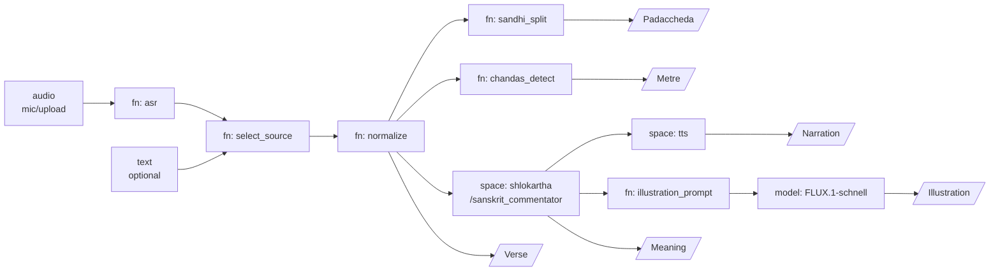

# Design: Ślōkārtha Voice Pipeline on gr.Workflow

**Date:** 2026-09-23
**Status:** Approved, ready for implementation planning
**Source spec:** `Spec Ślōkārtha Voice Pipeline on gr.Workflow.md`
**Deploys to:** a public Hugging Face Space (Gradio SDK, CPU basic)

## Overview and goals

A user chants or recites a śloka into the mic. The graph returns the verse in
Devanagari and IAST, its padaccheda (word split), meaning via the existing
Ślōkārtha Space, the metre, a narrated translation, and an illustration. The
Ślōkārtha checkpoint is reused as a Space node, not reimplemented.

Errors compound across ASR, normalization, sandhi and meaning. The canvas shows
each stage's output, so a wrong meaning can be traced to the stage that caused
it. That traceability is the reason to build this on `gr.Workflow` rather than
as a linear script.

### Success criteria

- Mic or uploaded audio of an Anuṣṭubh verse produces all six outputs in under
  60 s warm.
- Text-only entry (typed or pasted verse) reaches the same downstream nodes
  without executing ASR.
- Metre detection correct on the full 5-verse test set (see
  [Evaluation plan](#evaluation-plan) for why the set is this size).
- ASR character error rate reported per verse, so users see transcription
  confidence before trusting the meaning.
- Repository and both deployed Spaces are public and contain no tokens,
  absolute paths, or other local environment details.
- One full end-to-end pass costs under USD 0.25.

## Non-goals and constraints

**Non-goals:** retraining the Ślōkārtha checkpoint, full morphological analysis
(vibhakti, lakāra tagging), svara (Vedic accent) handling, and prose Sanskrit.

**Constraints inherited from the spec:**

- **No conditional edges.** "Text skips ASR" cannot be a branch. Both an audio
  and a text reference feed a `select_source` fn that prefers non-empty text.
  ASR must return an empty string on empty audio instead of raising, or the
  whole run fails.
- **External Space latency.** Ślōkārtha and TTS are Space nodes; each adds its
  own queue time and may be sleeping. Neither is under the workflow's control.
- **Text ports only** for structured data. Word splits and scansion travel as
  JSON strings.
- **Beta.** Mic capture on the canvas is new; test on mobile browsers before
  sharing.

**Constraints added during design:**

- **Public artifact.** The repository and both Spaces are public. No token, no
  absolute path, no local environment detail may appear in any commit.
- **Reference only published work.** Publicly released projects, checkpoints
  and datasets may be named and linked. Private repositories are referred to
  generically and never named, in the repository, the Space, or commit
  messages.
- **Budget.** Total spend across both examples in this repository is capped at
  USD 5. Development must not re-spend on every iteration.

## Platform findings that contradict the spec

Four behaviours documented in the `gr.Workflow` guide conflict with the
original spec. Each is resolved below rather than worked around silently.

### One endpoint per connected component, not per output

The guide states: *"Each disconnected pipeline containing one or more subject
nodes gets one endpoint. Its name is derived from the first subject's label…
If the pipeline has multiple subjects, the endpoint returns all of them in
subject declaration order rather than creating one endpoint per subject."*

The spec's six endpoints (`/verse`, `/padaccheda`, `/metre`, `/meaning`,
`/narration`, `/illustration`) are therefore not achievable from one connected
graph. They collapse into a single endpoint returning all six subjects.

This also resolves the spec's open risk, *"Calling /metre still executes ASR
upstream, making the cheap endpoint expensive."* The answer is that it would —
so the text-only spine ships as a **second disconnected component in the same
`workflow.json`**, which earns its own endpoint and genuinely executes no ASR,
no Space call and no GPU.

### `/sanskrit_commentator` accepts one argument

The spec's open question — *"does the Ślōkārtha Space endpoint take only the
verse, or can it accept padaccheda as a second input?"* — is answered by the
live API. `/sanskrit_commentator` takes `shloka` only.

However, `/interpret_sanskrit_verse` accepts a `system_prompt`, which is a
viable injection point for the word split. So the answer is: **not as a second
port, but yes via the system prompt.** The graph uses the clean single-argument
endpoint; the padaccheda-augmented arm is measured offline by the evaluation
harness, and the node is rewired only if the measurement justifies it.

### ASR is available inside the Ślōkārtha Space

The spec proposes Whisper large-v3 as the ASR baseline. The Ślōkārtha Space
already exposes `/transcribe_sanskrit_audio`, a Sanskrit-native ASR, free on
CPU. This becomes the default backend. Whisper via Inference Providers remains
selectable through configuration so the evaluation can compare the two, which
is what the spec's evaluation table asks for.

### Fan-out is parallel on the canvas and sequential through the API

The guide states: *"When the same workflow is invoked through its generated
Gradio API, the server currently executes these branches sequentially."*

So `sandhi_split`, `chandas_detect` and the meaning path genuinely run in
parallel when a human hits **Run** on the canvas, and genuinely run one after
another when the endpoint is called. The same applies to the TTS and FLUX
branches.

The spec's "under 60 s warm" is therefore a **canvas** number. Latency through
`/verse` is approximately the sum of the branches. Both are measured and
reported separately rather than designed around, because there is no way
around it.

## Verified external services

Every external dependency was confirmed public and running on 2026-09-23
before being pinned, so no node in this design rests on an unverified service:

| Service | Used for | Status |
| --- | --- | --- |
| [`kshitijthakkar/shlokartha-playground`](https://hf.co/spaces/kshitijthakkar/shlokartha-playground) | ASR, commentary | Public, RUNNING, cpu-basic |
| `innoai/Edge-TTS-Text-to-Speech` | Narration | Public, RUNNING, 1.3k likes |
| `black-forest-labs/FLUX.1-schnell` | Illustration | Served by Inference Providers |
| `prathoshap/vagdhenu-demo` | Chant variant (not default) | Public, RUNNING |
| `hugging-apps/sushrota-sanskrit-asr` | ASR alternative (not default) | Public, RUNNING |

**Provenance.** The Ślōkārtha Space serves the public
[`kshitijthakkar/shlokartha`](https://hf.co/kshitijthakkar/shlokartha)
checkpoint, fine-tuned on the public
[`kshitijthakkar/shlokartha-sft`](https://hf.co/datasets/kshitijthakkar/shlokartha-sft)
dataset, itself derived from `sarvamai/vagartha`. The whole meaning path is
therefore reproducible by anyone: open weights, open training data, open Space.
That is what makes reusing it as a node honest rather than a black box.

**Chant variant.** `prathoshap/vagdhenu-demo` exposes
`/synthesize(text, meter_choice, seed)`, which takes a metre — exactly what
`chandas_detect` produces. Feeding the detected metre into a chant of the verse
is an elegant closing of the loop and is free, but it narrates the *verse*
rather than the *meaning*, which is not what the spec asked for. It is
therefore documented as a one-line alternative in `config.yaml`, not the
default.

## Graph topology

Two disconnected components live in one `workflow.json`.

### Component A — full pipeline

`chandas_detect` runs off normalized text in parallel with the split and the
meaning path. TTS and FLUX run in parallel once the meaning lands. The first
subject is labelled `Verse`, so this component's endpoint is `/verse` and it
returns all six subjects in declaration order.

### Component B — text-only metre spine

Separate node instances, no shared edges with Component A, therefore a separate
endpoint `/metre_only`. No ASR, no Space call, no billed inference. This is the
cheap text-only Sanskrit utility API the spec wanted.

## Node specifications

| Node | Kind | Inputs | Outputs | Notes |
| --- | --- | --- | --- | --- |
| `audio` | reference | — | audio | Mic capture or upload; resampled to 16 kHz mono |
| `text` | reference | — | text | Optional; Devanagari, IAST, ITRANS or HK accepted |
| `asr` | fn | audio | text | Guards empty audio and returns `""`; otherwise calls the configured backend |
| `select_source` | fn | asr text, typed text | text (JSON) | `{text, source: "asr" \| "typed"}`; prefers non-empty typed text |
| `normalize` | fn | JSON | text (JSON) | Script detection, conversion to Devanagari and IAST, danda and pāda markers normalized |
| `sandhi_split` | fn | normalized JSON | text (JSON) | Padaccheda with top-3 candidate splits and scores |
| `chandas_detect` | fn | normalized JSON | text (JSON) | Laghu/guru pattern per pāda, syllable counts, metre name, confidence |
| `shlokartha` | space | verse | text | `kshitijthakkar/shlokartha-playground`, endpoint `/sanskrit_commentator` |
| `tts` | space | meaning, voice | audio | `innoai/Edge-TTS-Text-to-Speech`, endpoint `/tts_interface(text, voice, rate, pitch)`. Edge TTS carries both `hi-IN` and `en` voices, which is the spec's Hindi and English narration |
| `illustration_prompt` | fn | meaning | text | Deterministic template; strips theological specifics that image models mishandle |
| `flux` | model | prompt | image | `black-forest-labs/FLUX.1-schnell`, `text_to_image`, 1024×768 |

`asr` is an `fn` node rather than a `space` or `model` node specifically to
satisfy the spec's hard constraint that empty audio must not raise. A raw Space
node raises and fails the entire run. The fn checks first, then delegates.

`shlokartha` is a genuine `kind: "space"` node, honouring the spec's
requirement that the checkpoint be reused rather than reimplemented.

**TTS port handling.** `/tts_interface` takes four arguments, only one of which
(`text`) comes from upstream. The preferred approach is a `narration_voice`
reference node carrying a literal default of a `hi-IN` voice, feeding the
`voice` port, with `rate` and `pitch` declared `required: false`. This makes
the voice selectable on the canvas, at the cost of adding `voice` as a third
parameter to the `/verse` endpoint. Whether a `space` node honours defaults for
unconnected non-required ports is undocumented; if it does not, the fallback is
to wrap the call in an fn node. **Resolved against the live canvas during M4.**

Between this example and the Eval Arena, all four operator kinds are
demonstrated: `space`, `model` and `fn` here, `dataset` and `fn` there.

## Sanskrit text processing

All fn nodes are pure Python and deterministic, so they are cheap to run,
free to execute, and straightforward to unit test.

### Normalize

Detect the input scheme and transliterate with `indic_transliteration`
(sanscript) to both Devanagari and IAST. Normalize anusvāra against class
nasal, avagraha, and danda placement. Split into pādas on dandas, or by
syllable count when ASR output carries no punctuation.

Emits `{devanagari, iast, padas: [...], scheme, source}`.

### Sandhi split

Use `sanskrit_parser` for candidate padacchedas; keep the top 3 with scores.
Fall back to the unsplit verse if parsing exceeds 5 s, since long compounds can
blow up the search.

Emits `{splits: [{words: [...], score: float}], truncated: bool}`.

### Chandas detect

Syllabify IAST, then mark each syllable **guru** if it carries a long vowel, a
diphthong, an anusvāra or a visarga, or is followed by a conjunct; otherwise
**laghu**. Group syllables into ganas of three:

| Gana | Pattern | Gana | Pattern |
| --- | --- | --- | --- |
| ma | — — — | ya | ⏑ — — |
| na | ⏑ ⏑ ⏑ | ja | ⏑ — ⏑ |
| bha | — ⏑ ⏑ | ra | — ⏑ — |
| ta | — — ⏑ | sa | ⏑ ⏑ — |

Match per-pāda patterns against the metre table:

| Metre | Syllables per pāda | Identifying rule |
| --- | --- | --- |
| Anuṣṭubh | 8 | 5th laghu, 6th guru; 7th guru in odd pādas, laghu in even |
| Indravajrā | 11 | ta ta ja ga ga |
| Upendravajrā | 11 | ja ta ja ga ga |
| Vasantatilakā | 14 | ta bha ja ja ga ga |
| Mālinī | 15 | na na ma ya ya |
| Śikhariṇī | 17 | ya ma na sa bha la ga |
| Śārdūlavikrīḍita | 19 | ma sa ja sa ta ta ga |

Output the gana sequence and a confidence equal to the fraction of pādas that
match. Upajāti — mixed Indravajrā and Upendravajrā — is reported when pādas
differ only in the first syllable.

Emits `{metre, ganas_per_pada: [...], syllables_per_pada: [...], confidence}`.

## Error propagation and inspection

Each stage emits a confidence field so a bad meaning can be traced upstream on
the canvas without rerunning.

| Stage | Typical failure | Signal emitted | Downstream effect |
| --- | --- | --- | --- |
| `asr` | Merged words, dropped visarga, ṣ/ś confusion | Backend confidence where available | Wrong syllables break scansion and sandhi |
| `normalize` | Mixed-script input misdetected | Detected scheme | Garbage transliteration |
| `sandhi_split` | Wrong compound boundary | Top-3 split scores | Meaning misreads a compound |
| `chandas_detect` | ASR drift changes syllable count | Pāda match fraction | Metre reported with low confidence |
| `shlokartha` | Plausible but wrong gloss | None from the Space | Narration and image inherit the error |

The metre check doubles as an ASR sanity check. A known Anuṣṭubh verse that
fails scansion almost always means transcription drift. So **chandas confidence
below 0.75 marks the meaning as low-trust** in the meaning payload, propagated
as `low_trust: true`.

## REST API contract

The real contract, corrected for the one-endpoint-per-component rule.

### `/verse` — Component A

Parameters: `(audio, text, voice)`. `audio` and `text` may each be empty, but
not both. `voice` defaults to a `hi-IN` Edge TTS voice; see the TTS port
handling note in [Node specifications](#node-specifications).

Returns all six subjects in declaration order:

1. `verse` — JSON `{devanagari, iast, padas: [...], source}`
2. `padaccheda` — JSON `{splits: [{words, score}], truncated}`
3. `metre` — JSON `{metre, ganas_per_pada, syllables_per_pada, confidence}`
4. `meaning` — JSON `{meaning_en, meaning_hi?, low_trust: bool}`
5. `narration` — audio file
6. `illustration` — image file

### `/metre_only` — Component B

Parameters: `(text)`.

Returns JSON `{metre, ganas_per_pada, syllables_per_pada, confidence}`.

Executes no ASR, no Space call and no billed inference. This is the endpoint to
expose as a text-only Sanskrit utility API.

## Cost control

Total projected spend for one full end-to-end pass is under USD 0.25, and the
repository-wide cap is USD 5 across both examples. The architecture keeps it
there by construction:

- **Space nodes over billed inference.** ASR, commentary and TTS all run on
  public CPU Spaces and cost nothing. The only billed call in the graph is
  FLUX.1-schnell, at four steps.
- **Record and replay.** Every network call — Inference Providers and Space
  alike — goes through one thin client that records responses to
  `tests/fixtures/` on first live call and replays thereafter. Unit tests never
  touch the network. Development iterates on replays. Only an explicit `--live`
  flag spends anything.
- **Deterministic nodes are free.** `normalize`, `sandhi_split`,
  `chandas_detect` and `illustration_prompt` are pure CPU, so the entire
  Component B path and the whole metre evaluation cost zero.

## Deployment and auth

- **Hosting.** A public CPU-basic Space. `gr.Workflow(bind=[select_source,
  normalize, sandhi_split, chandas_detect, illustration_prompt, asr],
  graph="workflow.json")`.
- **Auth.** `hf_oauth: true` in the Space card, so ASR and FLUX calls bill to
  the visitor and the owner can edit the canvas. The Ślōkārtha and TTS Space
  calls hit those Spaces' own quotas.
- **Warmth.** Keep the Ślōkārtha Space awake during demos; a sleeping Space
  adds a cold start to every first run.
- **Dependencies.** Pin `gradio`, `indic_transliteration` and
  `sanskrit_parser`. The parser pulls large data files on first use, so fetch
  them at build time.
- **Secrets.** No token is read by the graph. `scripts/deploy.py` reads
  `HF_TOKEN` from the environment with no default and never logs it.

## Evaluation plan

Each stage is evaluated against its own gold rather than only end to end, so
regressions are attributable.

| Stage | Test set | Metric | Target |
| --- | --- | --- | --- |
| `asr` | 5 verses × 3 synthetic voices | Character error rate on IAST | **Not obtainable with synthetic audio** — verified live that `/transcribe_sanskrit_audio` returns an empty transcription for TTS-generated speech, so CER measured this way reflects the upstream ASR's behaviour on synthetic audio, not this pipeline; see `eval/run_asr_eval.py` |
| `chandas_detect` | 5 Gita verses (typed) | Metre accuracy | 5/5 |
| `chandas_detect` | Same 5 verses via ASR | Metre accuracy | **Not obtainable with synthetic audio** — depends on the same ASR transcriptions above, which come back empty for TTS audio, so there is no transcript for the metre matcher to score |
| `sandhi_split` | 5 verses with gold padaccheda | Top-1 / top-3 word F1 | Baseline, then set |
| `shlokartha` | 5 verses with reference translations | LLM-judge adequacy 1–5 | Verse-only vs verse + padaccheda |

**Sample size.** The spec called for 50 recorded verses and 100 Gita verses.
Both were reduced to 5 at the user's direction to hold the project near zero
cost. Every harness reads its row count from its data file, so restoring the
full sizes is a data change, not a code change. **Results at n=5 are reported
in the table labelled as not statistically meaningful**, alongside the command
to rerun at full size. A metre accuracy of 5/5 is a smoke test, not the ≥90%
claim the original spec targets.

**Reciter audio.** The spec's 50 verses recorded by 3 reciters do not exist and
cannot be recorded here. The harness instead synthesizes 5 verses × 3 voices
using public Sanskrit TTS endpoints with distinct voices and seeds, and reports
**synthetic-reciter CER**, explicitly labelled as such. Synthetic audio
understates the difficulty of real chanting — melisma and elongated vowels are
exactly what a TTS will not reproduce — so this number is a floor, not an
estimate of field performance.

**Meaning A/B.** The last row is also the experiment that answers the
padaccheda question. `eval/run_meaning_ab.py` calls `/sanskrit_commentator`
for the verse-only arm and `/interpret_sanskrit_verse` with the word split
embedded in `system_prompt` for the augmented arm, then scores both. If the
augmented arm wins, the `shlokartha` node is rewired to an fn wrapping
`/interpret_sanskrit_verse`.

## Testing strategy

- **Pure fn nodes** get direct unit tests: gana classification against the
  eight-gana table, metre matching for each row of the metre table, scheme
  detection across Devanagari / IAST / ITRANS / HK, the 5 s parser cap and its
  unsplit fallback, and `select_source` preference rules including both-empty
  and both-present cases.
- **`asr` empty-audio guard** is tested directly, since a regression there
  fails every run.
- **Network nodes** are tested against recorded fixtures through the
  record/replay client. No test hits the network.
- **`scripts/check_no_secrets.py`** runs as a test and as a pre-deploy gate
  over the whole repository, including commit messages. It scans for token
  shapes, Windows and POSIX absolute paths, and every term listed in
  `.secretscan-deny` — a gitignored local file holding internal project and
  checkpoint names, so the deny-list is never itself a public artifact. A
  short committed allowlist exempts the handful of lines in these design docs
  that quote path patterns as documentation.

## Risks and open questions

| Risk | Mitigation |
| --- | --- |
| A pinned third-party Space sleeps or changes its API | All five verified public and RUNNING on 2026-09-23; every Space id and endpoint lives in `config.yaml`, and the chant and Sushrota alternatives are documented fallbacks |
| Sanskrit ASR weak on chanted verse (melisma, elongated vowels) | Whisper backend selectable via config; text override always available |
| Ślōkārtha Space API changes break the node | Pin a Space revision or duplicate it under a fixed name |
| `sanskrit_parser` timeouts on long compounds | 5 s cap with unsplit fallback |
| FLUX misrenders deities or ritual objects | `illustration_prompt` keeps scenes abstract and landscape-led |
| Mic capture unreliable on mobile browsers | Test before sharing; upload path is the documented fallback |

**Open question carried into implementation:** whether an intermediate value
such as normalized text can be hand-edited on the canvas before re-running
downstream. If it can, those edits become a free ASR correction dataset. To be
confirmed against the deployed Space.

## Milestones

| Milestone | Exit criterion |
| --- | --- |
| M1: Text spine | Typed verse → normalize → chandas works on canvas; `/metre_only` returns |
| M2: Meaning | `sandhi_split` and Ślōkārtha Space node wired; meaning present in `/verse` |
| M3: Voice | Mic → asr → select_source; synthetic-reciter CER measured |
| M4: Media | TTS and FLUX branches live; all six subjects return |
| M5: Eval and publish | Evaluation table filled and labelled; Space public with OAuth |

## Sources

- [gr.Workflow guide](https://gradio.app/guides/workflows) —
  `guides/04_additional-features/18_workflows.md` in the Gradio repository
- [Wire It, Run It, Deploy It: AI Workflows in Gradio](https://github.com/huggingface/blog/blob/main/gradio-workflow-guide.md)
- [Gradio 6.22.0 release notes (webcam/mic capture)](https://github.com/gradio-app/gradio/releases/tag/gradio%406.22.0)
- Live API schema of `kshitijthakkar/shlokartha-playground`, read from
  `/gradio_api/info` on 2026-09-23
